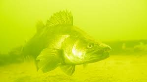
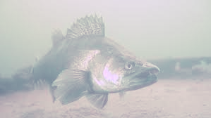

# Color correction with Color Channel Compensation (3C)

Based on the article: [https://ieeexplore.ieee.org/stamp/stamp.jsp?arnumber=8901447](https://ieeexplore.ieee.org/stamp/stamp.jsp?arnumber=8901447)

## Example

 | 
:--:|:--:
*Input* | *Result*